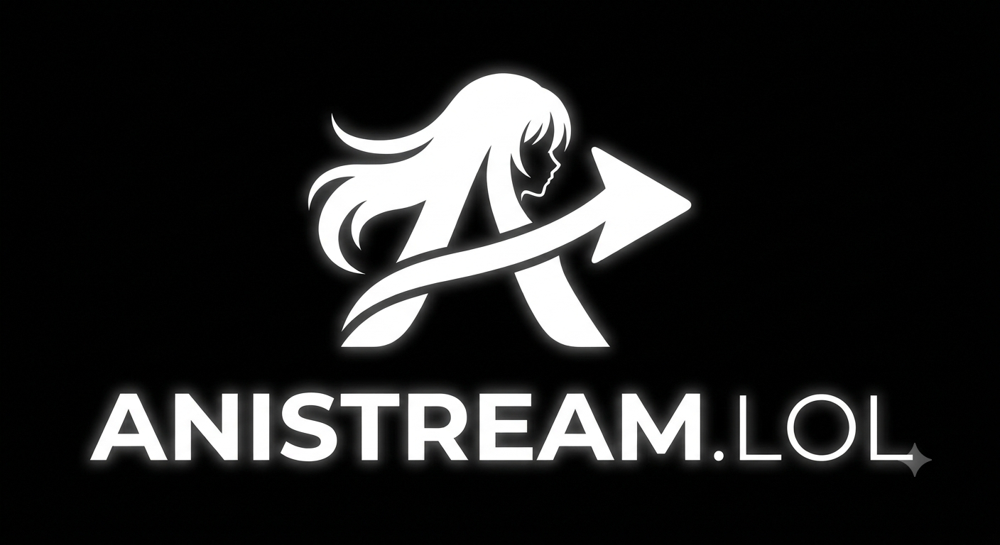

# AniStream

<p align="center">



</p>

<h3 align="center">
Deine Anime Streaming Plattform im Dark Neon Style
</h3>

<p align="center">


</p>

## Über AniStream

AniStream ist eine moderne, statische Anime-Webseite mit einem dunklen Premium-Design.

Die Webseite verwendet einen schwarzen Hintergrund mit weißen Neon-Glow-Effekten und bietet eine übersichtliche Darstellung von Anime-Serien, Staffeln und Episoden.

## Features

* ⚫ Dark Mode Streaming Design
* ✨ Weißer Neon Glow Effekt
* 🎌 Anime Übersicht mit Cover-Raster
* 🔎 Suchfunktion
* 📺 Serien-Seiten mit Staffeln und Folgen
* ▶️ Episoden Player Integration
* 📰 News Bereich
* 📱 Responsive Design für Handy und Desktop
* 🚀 Gehostet mit GitHub Pages

## Verwendete Technologien

### Frontend

* HTML5
* CSS3
* JavaScript

### Hosting

* GitHub Pages

### Datenverwaltung

Anime-Daten werden über eine JavaScript-Datei verwaltet:

```
anime.js
```

Dort werden später Serien, Cover, Staffeln, Episoden und Streaming-Links eingetragen.

## Projektstruktur

```
AniStream
│
├── index.html
├── anime.html
├── watch.html
│
├── style.css
├── script.js
├── anime.js
│
└── logo.png
```

## Design

Das Design basiert auf:

* Schwarzem Hintergrund
* Weißen Akzenten
* Neon Glow Effekten
* Modernem Streaming-Plattform Look

## Lizenz

Dieses Projekt steht unter der MIT License.

Du darfst den Code verwenden, verändern und weiterentwickeln, solange die Lizenzbedingungen eingehalten werden.

## Entwickler

**AniStream Team**

---

© 2026 AniStream
